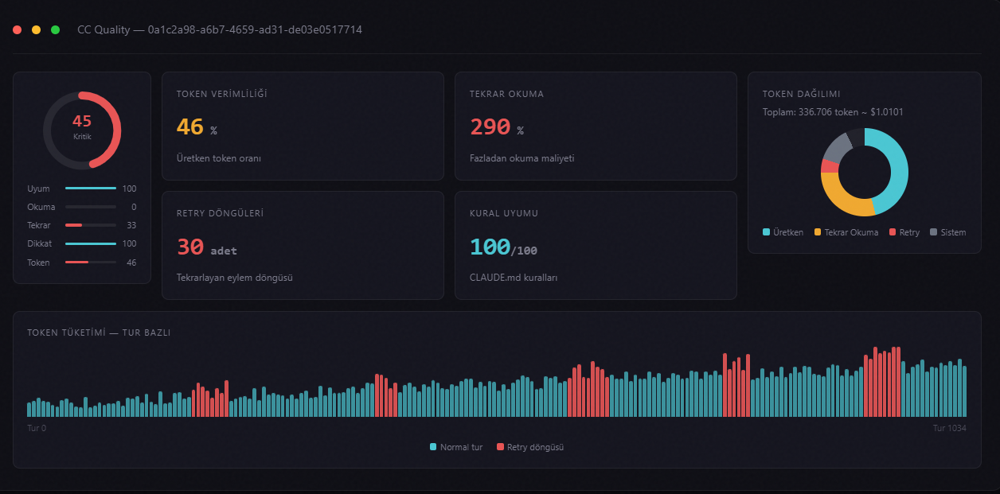

# CC Quality — Claude Code Session Quality Analyzer

[🇹🇷 Türkçe](README.md) · **🇬🇧 English**

> A browser-based tool that analyzes Claude Code sessions to detect silently burned tokens, retry loops, and rule violations.



[](https://react.dev)
[](https://www.typescriptlang.org)
[](https://vite.dev)
[](LICENSE)

**Live demo:** https://zenai360.github.io/ccquality/

---

## What Is CCQuality?

CCQuality is a browser tool that measures the quality of your conversations/sessions with Claude Code. It tells you:

- Did Claude use tokens efficiently, or did it get stuck in a loop?
- Did it waste tokens by re-reading the same files over and over?
- Did it follow the rules in your CLAUDE.md?
- What's the overall session quality score (SQI: Session Quality Index)?
- What can you do to optimize after the analysis?

**No installation.** Runs in the browser. Nothing goes to any server — all analysis happens on your device.

---

## What It Does

Claude Code records every conversation/session into a `.jsonl` file. CC Quality reads the file you select in the browser, runs it through 5 analysis engines, and produces a **Session Quality Index (SQI)** score:

| Engine | What It Measures |
|---|---|
| Rule Compliance | Compliance rate with CLAUDE.md rules |
| Retry Loop Detector | Tool calls stuck in loops and repeating error messages |
| Attention Dead Zone Mapper | Regions of CLAUDE.md that are being ignored |
| Re-Read Cost Calculator | Unnecessary re-reads of the same files |
| Waste Classifier | Token waste distribution across 6 categories |

**The project runs with "zero backend".** All analysis happens in the browser, on your device. No data ever leaves your machine.

---

## Usage

1. Find the `~/.claude/projects/<project>/session-<id>.jsonl` file
2. Prepare the `CLAUDE.md` file at your project root
3. Open CC Quality → drag-and-drop the files → wait for analysis (1–5s)
4. Read the SQI score and findings, feed the recommendations back into your CLAUDE.md

Detailed guide: [docs/CCQuality — Kurulum ve Kullanım Rehberi.md](docs/CCQuality%20—%20Kurulum%20ve%20Kullanım%20Rehberi.md) (Turkish)
Overview: [CC-Quality-Architecture-EN.html](CC-Quality-Architecture-EN.html)

---

## GitHub Pages Deploy

Add a base path to `vite.config.ts`, otherwise asset URLs will break:
```ts
base: '/ccquality/'
```

```bash
npm run build
# dist/ → push to the gh-pages branch
```

Repo → **Settings → Pages → Source: gh-pages branch**.

---

## Project Structure

```
src/
  core/
    parser/       # JSONL parser, token counter
    analyzers/    # 5 analysis engines
    scoring/      # SQI calculator, anomaly tagger, recommendation engine
  ui/
    components/   # SQIGauge, TokenTimeline, AttentionHeatmap, WasteDonut…
    pages/        # UploadPage, DashboardPage
    context/      # Language (TR/EN) context
  workers/        # Web Workers (large file parsing)
  types/          # All TypeScript interfaces
  i18n/           # TR/EN translations
docs/
    CCQuality — Kurulum ve Kullanım Rehberi.md
```

---

## Tech Stack

| | |
|---|---|
| **UI** | React 18 + TypeScript (strict) |
| **Build** | Vite 6 |
| **Charts** | Recharts |
| **Styles** | Tailwind CSS 4 (design tokens) |
| **Tests** | Vitest + jsdom |
| **Parsing** | Web Workers (main thread stays unblocked, max 200 MB) |

---

## Contributing

1. Fork the repo
2. Open a feature branch: `git checkout -b feat/feature-name`
3. Make your changes (`npm run lint && npm run test` must pass)
4. Open a PR — keep it focused on a single concern

Code conventions: [CLAUDE.md](CLAUDE.md)

---

## License

MIT © Zen AI 360
